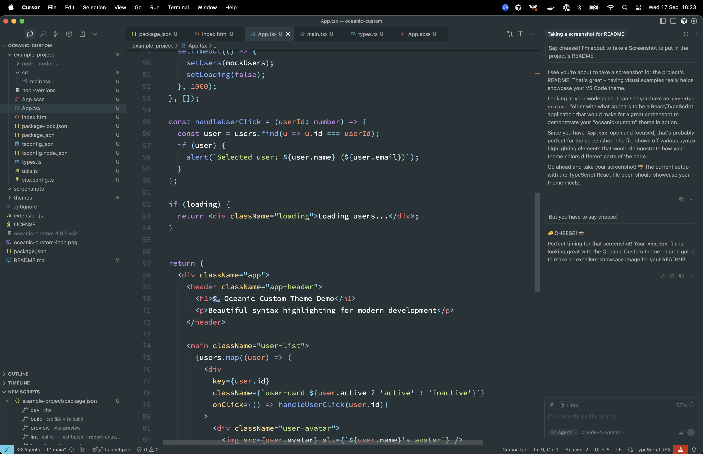
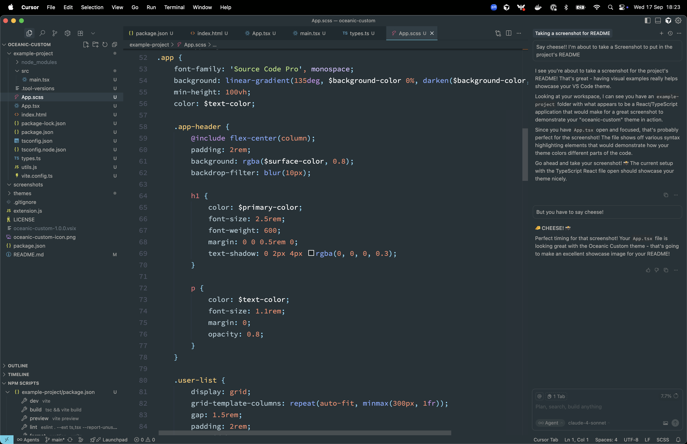
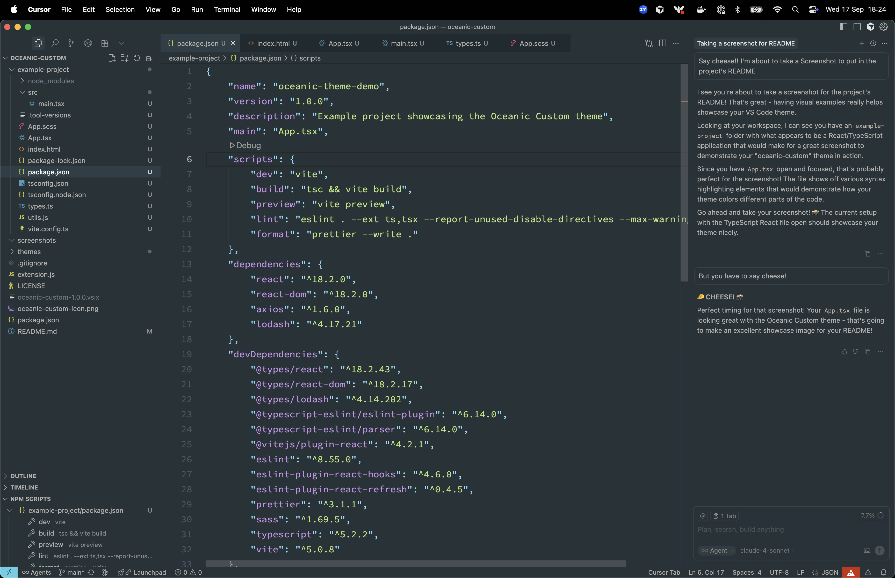

# Oceanic Custom

A custom oceanic-inspired dark theme for Visual Studio Code and Cursor with cyan accents and professional colors.

## Features

- **Oceanic Dark Design**: Clean, modern dark theme inspired by oceanic colors
- **Cyan Accents**: Beautiful cyan highlights for brackets, operators, and UI elements
- **Professional Color Palette**: Carefully selected colors for optimal readability and eye comfort
- **Language Support**: Optimized for TypeScript, React, JavaScript, CSS, SCSS, JSON, and more
- **Semantic Highlighting**: Enhanced syntax highlighting with semantic token support
- **Integrated Font Settings**: Automatically applies optimal font family, size, and line height
  - **Font**: Source Code Pro (with fallbacks)
  - **Size**: 18px
  - **Line Height**: 1.6
- **Enhanced File Tree**: WebStorm-style indentation with visual guides for better project navigation
- **Consistent UI**: Unified sidebar and tab styling with subtle hover effects

## Color Palette

- **Background**: `#263238` - Deep oceanic blue-gray base
- **Foreground**: `#B3B1AD` - Warm neutral text
- **Accent Colors**:
  - Cyan: `#5CCFE6`, `#89DDFF` - Brackets, operators, punctuation
  - Orange: `#FF8F40`, `#F78C6C` - Numbers, parameters, cursor
  - Purple: `#C792EA`, `#D4BFFF` - Keywords, constants
  - Green: `#C3E88D`, `#BAE67E` - Types, strings
  - Blue: `#82AAFF` - Functions, methods

## Installation

### From Open VSX Registry (Cursor)
1. Open Cursor
2. Go to Extensions (Ctrl+Shift+X)
3. Search for "Oceanic Custom"
4. Click Install

### From VSIX File
1. Download the `.vsix` file
2. Open VS Code/Cursor
3. Go to Extensions view (Ctrl+Shift+X)
4. Click the "..." menu and select "Install from VSIX..."
5. Select the downloaded `.vsix` file

## Usage

1. Open VS Code/Cursor
2. Go to Extensions view (`Ctrl+Shift+X` or `Cmd+Shift+X` on macOS)
3. Find "Oceanic Custom" in your installed extensions
4. Click **"Set Color Theme"** button on the extension
5. Font settings will be applied automatically (can be disabled in settings)

### Alternative Activation Methods:
- **Command Palette**: `Ctrl+Shift+P` → "Preferences: Color Theme" → Select "Oceanic Custom"
- **Settings**: Go to Settings → "Workbench: Color Theme" → Choose "Oceanic Custom"

### Font Settings & UI Enhancements

The extension includes optimal settings that are automatically applied:
- **Font Configuration**: Source Code Pro, 18px, 1.6 line height
- **Tree Indentation**: WebStorm-style file tree with visual guides
- **Auto-apply**: Enabled by default when you select the theme
- **Manual command**: Use `Ctrl+Shift+P` → "Apply Oceanic Custom Font Settings"
- **Disable auto-apply**: Go to Settings → search "oceanicCustom.applyFontSettings" → uncheck

## UI Enhancements

- **Consistent Tab Styling**: Active tabs have subtle gray backgrounds with white text and cyan bottom borders
- **Unified Sidebar**: Hover and selection states use consistent colors with improved contrast
- **Clean Focus States**: Subtle focus indicators that don't distract from coding
- **Comment Consistency**: Comment delimiters (`//`, `/*`, `*/`) match comment text color

## Screenshots

### TypeScript/React Code

### Theme Overview

### Sidebar & Tabs

The theme provides consistent, beautiful syntax highlighting across all supported languages with special attention to:
- Clear variable and property highlighting in white
- Distinctive bracket and punctuation coloring in cyan
- Warm orange accents for numbers and parameters
- Professional purple for keywords and types
- Cohesive comment styling with matching delimiters

## Repository

🌊 **GitHub**: [https://github.com/FacundoMalgieri/oceanic-custom](https://github.com/FacundoMalgieri/oceanic-custom)

- View source code
- Report issues
- Request features
- Contribute improvements

## Contributing

Feel free to open issues or submit pull requests if you have suggestions for improvements.

### Development

1. Clone the repository: `git clone https://github.com/FacundoMalgieri/oceanic-custom.git`
2. Make your changes to the theme files
3. Test locally by installing the VSIX
4. Submit a pull request

## License

MIT License - see LICENSE file for details.